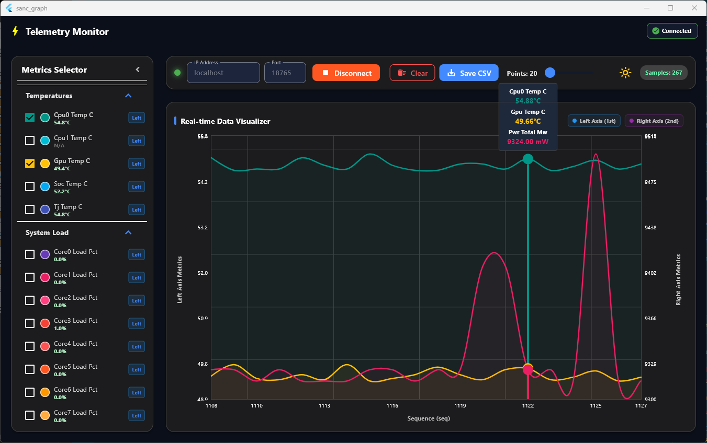

# sanc_graph

plotting tool which parses incoming data stream via specific data format and display line chart

- Parses first packet to understand what kind of parameters are comming and display its incoming parameters at Metrix Selector panel
- Choose parameters which want to plot
- Start/Stop CSV saves incoming parameters to CSV file
- Control plot width via Poiints bar
- Move parameters Y-axis to left or right



## Data stream format

SSE (Server-Sent Events) HTTP stream

- data format
  - 'data:'
    - '{'
    - "ts":timestamp
    - "seq":3
    - "d":{
      - "cpu0_temp_c":54.75
      - "cpu1_temp_c":49.69
      - "gpu_temp_c":null
      - "soc_temp_c":null
      - "tj_temp_c":null
      - "cpu_load_pct":1.2
      - "core0_load_pct":0.0
      - "core1_load_pct":0.0
      - "core2_load_pct":0.0
      - "core3_load_pct":0.0
      - "core4_load_pct":0.0
      - "core5_load_pct":0.0
      - "core6_load_pct":0.0
      - "core7_load_pct":0.0
      - "gpu_load_pct":null
      - "cpu_clk_mhz":null
      - "gpu_clk_mhz":null
      - "emc_clk_mhz":null
      - "pwr_cpu_mw":null
      - "pwr_gpu_mw":null
      - "pwr_soc_mw":null
      - "pwr_total_mw":null
    - '}'
- Example data sample

  ```bash
  data: {"ts":1782717271072,"seq":7,"d":{"cpu0_temp_c":54.75,"cpu1_temp_c":49.69,"gpu_temp_c":null,"soc_temp_c":null,"tj_temp_c":null,"cpu_load_pct":1.2,"core0_load_pct":0.0,"core1_load_pct":0.0,"core2_load_pct":0.0,"core3_load_pct":0.0,"core4_load_pct":0.0,"core5_load_pct":0.0,"core6_load_pct":0.0,"core7_load_pct":0.0,"gpu_load_pct":null,"cpu_clk_mhz":null,"gpu_clk_mhz":null,"emc_clk_mhz":null,"pwr_cpu_mw":null,"pwr_gpu_mw":null,"pwr_soc_mw":null,"pwr_total_mw":null}}
  ```

## History

- 2026.07.02
  - CSV start/stop buttom added
- 2026.07.16
  - add log panel at bottom
  - add icon

## Info

- Author : <louiey.dev@gmail.com>
- Flutter/Dart
